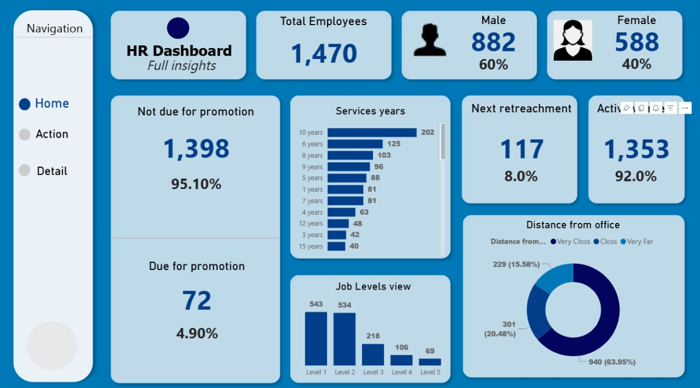
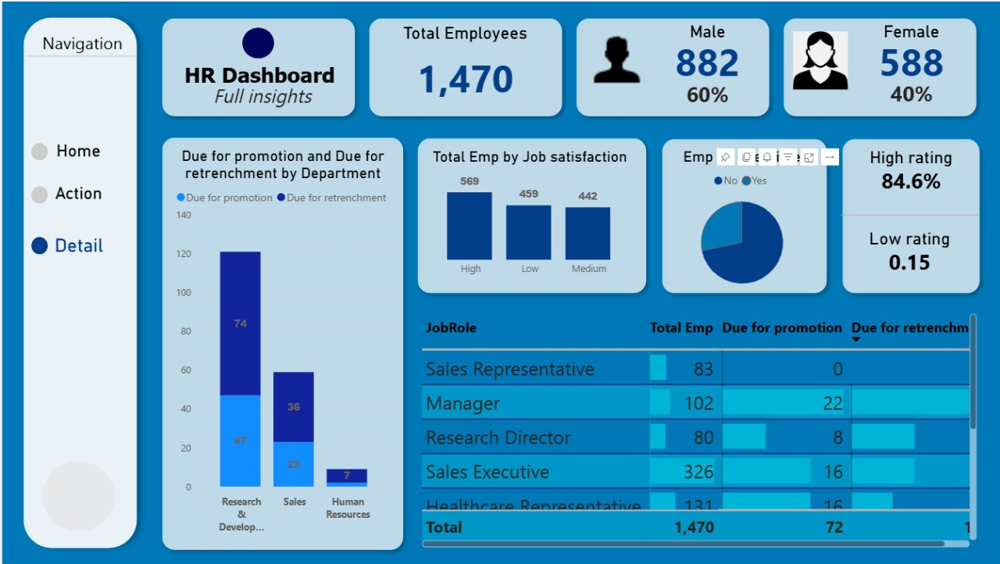
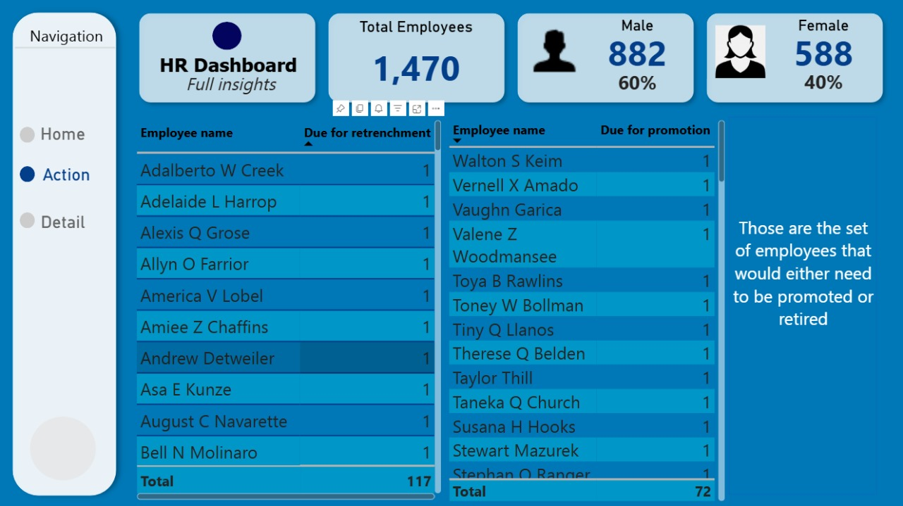

# HR Analytics Dashboard - Power BI Project


## 📊 Project Overview

An interactive HR Analytics Dashboard built with Microsoft Power BI that transforms raw employee data into actionable insights. This dashboard helps HR professionals and business leaders make data-driven decisions about workforce management, employee retention, and organizational planning.

### Key Objectives
- Analyze employee attrition patterns and identify key drivers
- Monitor workforce demographics and distribution
- Track employee performance and satisfaction metrics
- Provide real-time insights for strategic HR decision-making
- Enable detailed workforce analytics through interactive visualizations

## 🎯 Key Features

- **Comprehensive Employee Overview**: Track total headcount, active employees, and key demographic distributions
- **Attrition Analysis**: Deep dive into turnover rates by department, age group, job role, education, and salary
- **Performance Metrics**: Monitor employee satisfaction scores and performance ratings
- **Interactive Filtering**: Dynamic slicers for department, job role, gender, education, and more
- **Visual Analytics**: Charts, graphs, and KPI cards for quick insights
- **Drill-Through Capabilities**: Navigate from high-level metrics to detailed employee data

## 📸 Dashboard Preview

### Home Dashboard


### Detailed Analytics


### Action Items & Insights


## 📁 Repository Contents

```
HR-Analytics-Dashboard-Power-BI-Project/
│
├── Power BI HR Dashboard.pbix    # Main Power BI dashboard file
├── HR Analytics Data.csv         # Primary HR dataset
├── HR employee data.csv          # Supplementary employee data
├── Home.jpg                      # Dashboard home page screenshot
├── Detail.jpg                    # Detailed analytics view screenshot
├── Action.jpg                    # Action items view screenshot
└── README.md                     # Project documentation
```

## 🔧 Tools & Technologies

- **Power BI Desktop**: Dashboard design and development
- **Power Query**: Data cleaning, transformation, and ETL processes
- **DAX (Data Analysis Expressions)**: Custom measures and calculated columns
- **CSV Data Sources**: Employee and analytics data

## 📊 Key Metrics & KPIs

The dashboard tracks and visualizes the following key metrics:

### Core KPIs
- **Total Employees**: Overall workforce count
- **Attrition Count**: Number of employees who left
- **Attrition Rate**: Percentage of workforce turnover
- **Active Employees**: Current active headcount
- **Average Age**: Mean employee age across organization
- **Average Salary**: Mean compensation across the workforce
- **Average Tenure**: Average years of service

### Analysis Dimensions
- Department-wise distribution
- Age group segmentation
- Gender demographics
- Education level breakdown
- Job role categorization
- Salary slab analysis
- Years at company trends

## 💡 Key Insights

The dashboard reveals critical workforce patterns:

1. **Attrition Trends**: Identify which departments and roles have the highest turnover
2. **Demographic Patterns**: Understand workforce composition by age, gender, and education
3. **Compensation Analysis**: Analyze salary distributions and their impact on retention
4. **Tenure Insights**: Track employee longevity and identify retention risk periods
5. **Performance Correlation**: Link satisfaction scores with attrition rates

## 🚀 Getting Started

### Prerequisites
- Microsoft Power BI Desktop (Download from [Microsoft Power BI](https://powerbi.microsoft.com/desktop/))
- Windows 10 or later (for Power BI Desktop)

### Installation Steps

1. **Clone the repository**
   ```bash
   git clone https://github.com/Ahmed249323/HR-Analytics-Dashboard-Power-BI-Project.git
   cd HR-Analytics-Dashboard-Power-BI-Project
   ```

2. **Open the Power BI file**
   - Launch Power BI Desktop
   - Open `Power BI HR Dashboard.pbix`

3. **Verify data connections**
   - The dashboard uses `HR Analytics Data.csv` and `HR employee data.csv`
   - If prompted, update the data source path to your local directory
   - Click "Refresh" to reload the data

4. **Explore the dashboard**
   - Navigate through different pages: Home, Detail, and Action views
   - Use slicers and filters to interact with the data
   - Hover over visuals for detailed tooltips
   - Click on charts to cross-filter other visualizations

## 📈 Dashboard Pages

### 1. Home Page
The main overview page featuring:
- High-level KPIs and metrics
- Attrition rate visualization
- Department-wise employee distribution
- Key trends and patterns

### 2. Detail Page
Comprehensive analytics including:
- Detailed demographic breakdowns
- Multi-dimensional analysis
- Correlation between various factors
- Advanced filtering options

### 3. Action Page
Actionable insights and recommendations:
- Priority areas for HR intervention
- Risk indicators and alerts
- Strategic recommendations
- Focus areas for retention improvement

## 🔄 Data Processing

### Data Sources
- **HR Analytics Data.csv**: Contains employee demographics, job information, and attrition status
- **HR employee data.csv**: Supplementary employee records and additional attributes

### Data Transformation (Power Query)
- Removed duplicate records
- Handled missing values appropriately
- Standardized data formats (dates, text, numbers)
- Created calculated columns for age groups, salary slabs, and tenure categories
- Merged datasets for comprehensive analysis

### Data Model
- Established relationships between employee and analytics tables
- Created dimension tables for departments, job roles, and education levels
- Optimized model for fast query performance

## 🎓 Learning Outcomes

This project demonstrates:
- Advanced Power BI dashboard development
- Data modeling and relationship management
- DAX formula creation for business metrics
- Power Query for ETL operations
- Data visualization best practices
- HR analytics and business intelligence
- Interactive report design and UX principles

## 🔮 Future Enhancements

- [ ] Predictive analytics for attrition forecasting
- [ ] Integration with live HR databases
- [ ] Mobile-responsive dashboard layout
- [ ] Automated monthly report generation
- [ ] Benchmarking against industry standards
- [ ] Employee sentiment analysis from surveys
- [ ] Cost analysis of attrition

## 🤝 Contributing

Contributions are welcome! If you have suggestions for improvements:

1. Fork the repository
2. Create a feature branch (`git checkout -b feature/YourFeature`)
3. Commit your changes (`git commit -m 'Add YourFeature'`)
4. Push to the branch (`git push origin feature/YourFeature`)
5. Open a Pull Request

## 📄 License

This project is available for educational and portfolio purposes. When using this project or similar approaches with real HR data, ensure compliance with data privacy regulations (GDPR, CCPA, etc.).

## 👤 Author

**Ahmed**
- GitHub: [@Ahmed249323](https://github.com/Ahmed249323)
- LinkedIn: [Connect with me](www.linkedin.com/in/ahmed-abdel-baqi)


## 📞 Support

If you find this project helpful, please ⭐ star the repository!

For questions or suggestions:
- Open an [issue](https://github.com/Ahmed249323/HR-Analytics-Dashboard-Power-BI-Project/issues)
- Reach out via GitHub or LinkedIn

---

**Note**: This dashboard uses sample/anonymized data for demonstration purposes. Always ensure data privacy and security when working with actual employee information.

*Last Updated: October 2025*
